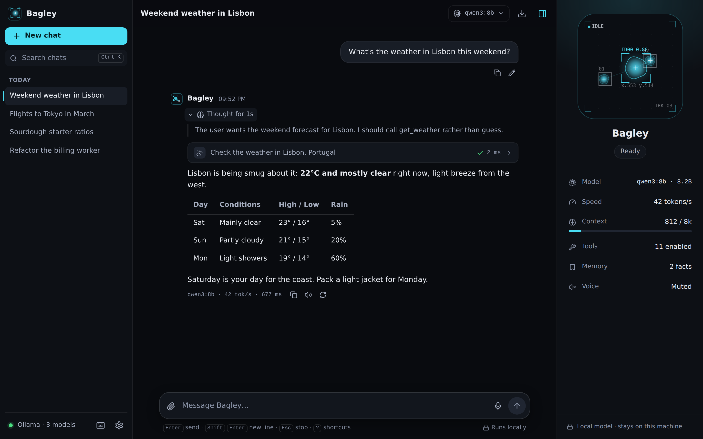
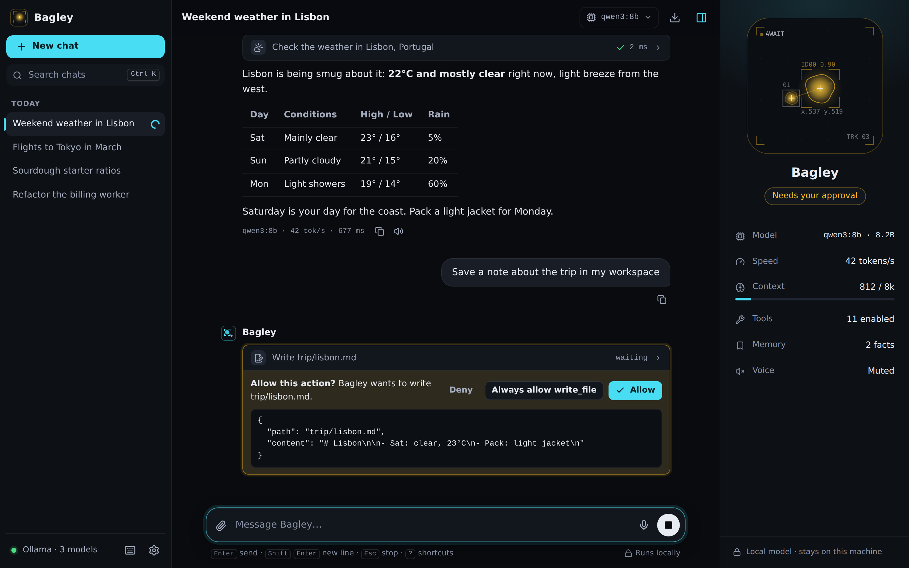
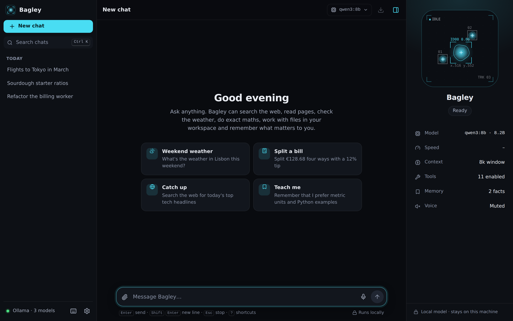
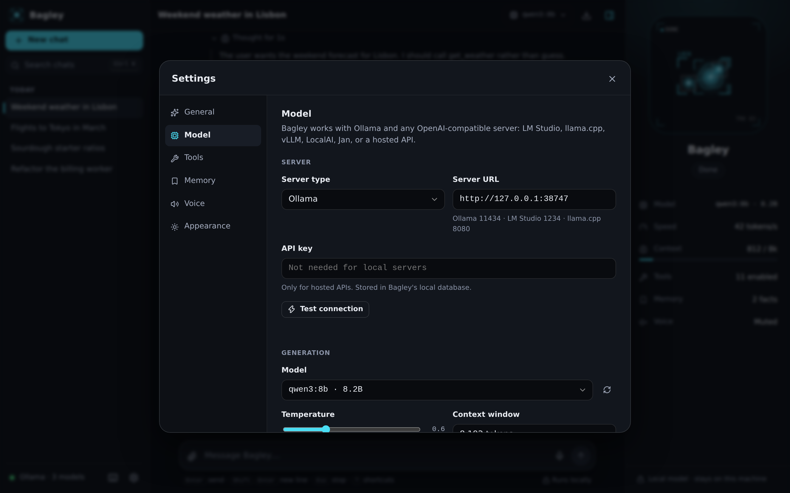
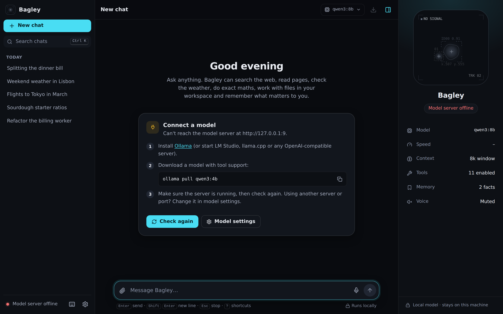
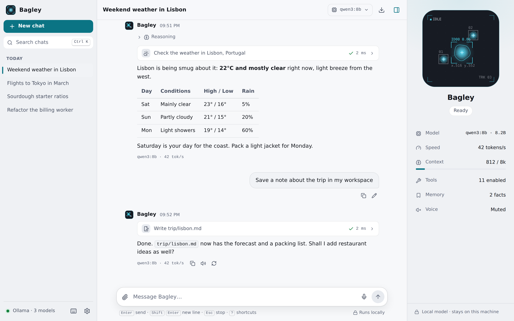
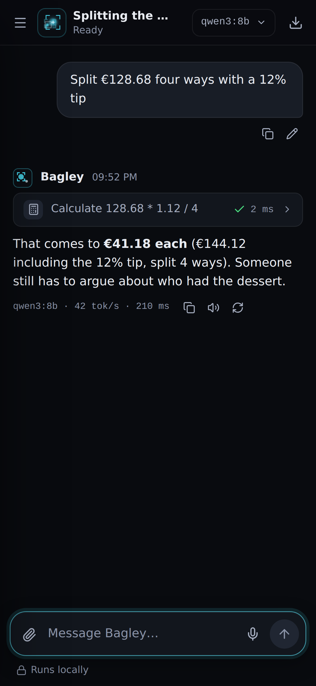
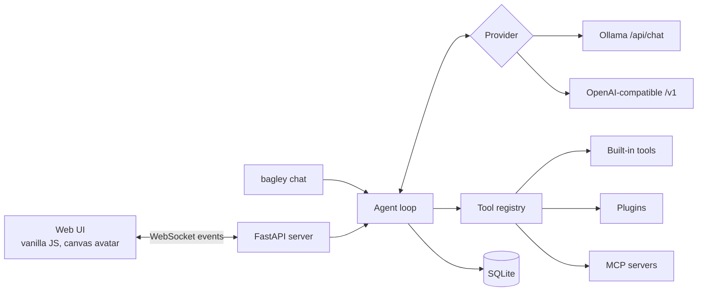

<div align="center">


# Bagley

A local-first AI assistant with an animated avatar, tool use and a web UI.<br>
Runs on Ollama or any OpenAI-compatible model server. Your conversations stay on your machine.

[](https://github.com/H4ch1Net/bagley-assistant/actions/workflows/ci.yml)


[](LICENSE)



</div>

## Overview

Bagley is a personal assistant that runs against a model on your own computer. It is agentic: the model can call tools (search the web, read pages, check the weather, do exact maths, work with files, remember facts about you), look at the results and keep going until it has an answer. Actions that change things ask for your approval first.

It is a single Python package with no build step. The server is FastAPI, the UI is plain JavaScript, and everything is stored in one SQLite file.

## Features

| | |
|---|---|
| **Animated avatar** | A minimal blob-tracking display: soft blobs drift in a dark viewport under thin tracking boxes, centroids and readouts. Their number, speed, links and colour show what Bagley is doing: a few slow tracks when idle, a dense linked mesh while thinking, a scan line and the tool's name while a tool runs, amber while it waits for approval, a lock-on box when a reply lands, dim dashed tracks when the model server is offline. |
| **Local models** | Native Ollama support (context size, reasoning, one-click model downloads) and any OpenAI-compatible server: LM Studio, llama.cpp, vLLM, LocalAI, Jan, OpenRouter, OpenAI. |
| **Agent loop** | Multi-step tool calling with streaming, cancellation, step limits and approvals. Models without native function calling use a text-based tool protocol automatically. |
| **Built-in tools** | Web search, page reader, weather, calculator, time zones, workspace files, long-term memory, optional shell. |
| **Extensible** | Drop a Python file into the plugins folder, or connect any MCP (Model Context Protocol) server. |
| **Reasoning models** | Thinking from qwen3, deepseek-r1 or gpt-oss streams into a collapsible block, separate from the answer. |
| **Chat history** | Search, rename, delete with undo, Markdown export, edit and resend, regenerate, deep links. |
| **Attachments** | Drop text files on the composer. They are saved to the workspace where the file tools can read them. |
| **Voice** | Read replies aloud with your system voices (the tracked blobs pulse with each word). Optional dictation where the browser supports it. |
| **Interface** | Dark and light themes, accent colours, keyboard shortcuts, responsive down to phone width, reduced-motion support, a tab-title marker when a reply finishes in the background. |
| **Terminal** | `bagley chat` for a terminal session and `bagley doctor` to check your setup. |

## Quick start

**1. Run a model server.** The easiest is [Ollama](https://ollama.com/download):

```bash
ollama pull qwen3:4b
```

Any model works. Models with tool support give the best results; see [Choosing a model](#choosing-a-model).

**2. Install Bagley** (Python 3.10 or newer):

```bash
pipx install git+https://github.com/H4ch1Net/bagley-assistant
# or: uv tool install git+https://github.com/H4ch1Net/bagley-assistant
# or, from a clone: pip install -e .
```

**3. Start it:**

```bash
bagley
```

This opens <http://127.0.0.1:8765>. If no model server is found, the start screen walks you through connecting one, and with Ollama you can download models from the UI.

## Screenshots

<table>
  <tr>
    <td width="50%"><br><sub>Actions that change things wait for approval.</sub></td>
    <td width="50%"><br><sub>Start screen.</sub></td>
  </tr>
  <tr>
    <td><br><sub>Model settings. Server type, URL, model, context and tool mode.</sub></td>
    <td><br><sub>First run without a model server. The tracker reads NO SIGNAL.</sub></td>
  </tr>
  <tr>
    <td><br><sub>Light theme.</sub></td>
    <td align="center"><br><sub>Phone layout.</sub></td>
  </tr>
</table>

## Usage

### Web UI

Type a message and press <kbd>Enter</kbd>. Tool calls appear as cards you can expand to see arguments and results. The panel on the right shows the avatar, the current state, the model, generation speed, context usage, enabled tools and saved memories. Hide it with <kbd>Ctrl</kbd> <kbd>.</kbd> and the avatar moves to the top bar.

| Shortcut | Action |
|---|---|
| <kbd>Ctrl</kbd> <kbd>Shift</kbd> <kbd>O</kbd> | New chat |
| <kbd>Ctrl</kbd> <kbd>K</kbd> | Search chats |
| <kbd>/</kbd> | Focus the message box |
| <kbd>Esc</kbd> | Stop the current reply |
| <kbd>↑</kbd> | Edit your last message (in an empty message box) |
| <kbd>Ctrl</kbd> <kbd>Shift</kbd> <kbd>C</kbd> | Copy the last reply |
| <kbd>Ctrl</kbd> <kbd>.</kbd> | Toggle the Bagley panel |
| <kbd>Ctrl</kbd> <kbd>,</kbd> | Settings |
| <kbd>?</kbd> | Show all shortcuts |

On macOS use <kbd>⌘</kbd> instead of <kbd>Ctrl</kbd>.

### Command line

| Command | Description |
|---|---|
| `bagley` | Start the server and open the browser. Same as `bagley serve`. |
| `bagley serve --port 9000 --no-browser` | Start on another port without opening a tab. `--host` sets the bind address. |
| `bagley chat` | Chat in the terminal. `-c <id>` continues a conversation. Approvals are asked inline. |
| `bagley doctor` | Check the model server, installed models, tool support, workspace, plugins and MCP servers. |
| `python -m bagley` | Same as `bagley`. |

### Tools

| Tool | What it does | Asks first |
|---|---|:---:|
| `web_search` | Search DuckDuckGo, or your SearXNG instance | |
| `fetch_webpage` | Download a page and extract readable text | |
| `get_weather` | Current weather and forecast from Open-Meteo | |
| `calculate` | Exact arithmetic and math functions, evaluated safely | |
| `get_current_time` | Date and time in any time zone | |
| `list_files` `read_file` `search_files` | Browse and read the workspace folder | |
| `write_file` | Create or change a file in the workspace | ✓ |
| `remember` `forget` | Long-term memory, injected into every conversation | |
| `run_command` | Run a shell command in the workspace. Off unless `BAGLEY_ENABLE_SHELL=true` | ✓ |

Tools can be switched off individually in **Settings → Tools**. File tools cannot leave the workspace folder, and web tools refuse localhost and private network addresses unless you allow them.

## Choosing a model

Bagley picks the first installed model that supports tools unless you choose one. Good starting points with Ollama:

| Model | Size | Notes |
|---|---|---|
| `qwen3:4b` | 2.5 GB | Fast, reliable tool use. Recommended default. |
| `llama3.2:3b` | 2.0 GB | Small and quick. |
| `qwen3:8b` | 5.2 GB | Better reasoning. |
| `gpt-oss:20b` | 14 GB | Best quality of these. Needs about 16 GB of memory. |

Models without native function calling (for example `gemma2`) still get tools through the text-based protocol. You can force a mode under **Settings → Model → Tool calling**.

### Other servers

Point Bagley at any OpenAI-compatible endpoint in **Settings → Model**, or with environment variables:

| Server | `BAGLEY_BASE_URL` |
|---|---|
| Ollama | `http://localhost:11434` |
| LM Studio | `http://localhost:1234/v1` |
| llama.cpp (`llama-server --jinja`) | `http://localhost:8080/v1` |
| vLLM | `http://localhost:8000/v1` |
| OpenRouter, OpenAI and other hosted APIs | the provider's base URL, plus `BAGLEY_API_KEY` |

With `BAGLEY_PROVIDER=auto` (the default) Bagley detects Ollama by its API and treats anything else as OpenAI-compatible.

## Configuration

Settings changed in the UI are stored in the database. Environment variables (or a `.env` file in the directory you start Bagley from) take precedence, and fields set that way are shown as locked in the UI. See [`.env.example`](.env.example) for every option.

<details>
<summary><b>Environment variables</b></summary>

| Variable | Default | Description |
|---|---|---|
| `BAGLEY_PROVIDER` | `auto` | `auto`, `ollama` or `openai` |
| `BAGLEY_BASE_URL` | `http://localhost:11434` | Model server URL. `OLLAMA_HOST` is used if this is unset. |
| `BAGLEY_API_KEY` | | For hosted APIs |
| `BAGLEY_MODEL` | first tool-capable model | Model name |
| `BAGLEY_TEMPERATURE` | `0.6` | 0 to 2 |
| `BAGLEY_CONTEXT_TOKENS` | `8192` | Context window. Sent to Ollama as `num_ctx`; history is trimmed to fit. |
| `BAGLEY_MAX_STEPS` | `8` | Tool rounds per reply |
| `BAGLEY_TOOL_MODE` | `auto` | `auto`, `native`, `prompt` (text-based) or `off` |
| `BAGLEY_THINK` | `false` | Let reasoning models think before answering |
| `BAGLEY_PERSONA` | `bagley` | `bagley`, `professional` or `concise` |
| `BAGLEY_HOST` | `127.0.0.1` | Bind address |
| `BAGLEY_PORT` | `8765` | Port |
| `BAGLEY_TOKEN` | | Access token. Generated automatically when listening beyond localhost. |
| `BAGLEY_ALLOWED_HOSTS` | | Extra Host header names, comma separated |
| `BAGLEY_DATA_DIR` | `~/.bagley` | Database, workspace, plugins |
| `BAGLEY_WORKSPACE` | `<data dir>/workspace` | Folder the file tools can use |
| `BAGLEY_PLUGINS_DIR` | `<data dir>/plugins` | Python files with extra tools |
| `BAGLEY_MCP_CONFIG` | `<data dir>/mcp.json` | MCP server list |
| `BAGLEY_ENABLE_SHELL` | `false` | Register the `run_command` tool |
| `BAGLEY_ALLOW_PRIVATE_URLS` | `false` | Let web tools reach private addresses |
| `BAGLEY_SEARXNG_URL` | | Use SearXNG for web search |

</details>

Data lives in `~/.bagley`: `bagley.db` (chats, memories, settings), `workspace/`, `plugins/` and `mcp.json`. Deleted chats can be restored with Undo; they are purged on the first start more than 24 hours after deletion.

## Extending

### Plugins

Any Python file in `~/.bagley/plugins/` is loaded at startup. Decorate functions with `@tool`; type hints become the parameter schema and the docstring becomes the description the model sees.

```python
from typing import Annotated
from bagley.tools import ToolContext, tool

@tool(summary="Roll {count}d{sides}")
def roll_dice(sides: Annotated[int, "Faces per die"] = 6, count: int = 1) -> dict:
    """Roll dice and return each result and the total."""
    ...

@tool(risk="confirm")  # Ask the user before every call.
def send_report(ctx: ToolContext, text: str) -> str:
    """Write a report into the workspace."""
    (ctx.config.workspace / "report.md").write_text(text)
    return "Saved."
```

A complete example is in [`examples/plugins/example_tools.py`](examples/plugins/example_tools.py). Load errors are listed in **Settings → Tools** and in `bagley doctor`.

### MCP servers

Bagley is an MCP client for stdio servers. Create `~/.bagley/mcp.json` in the same format other MCP clients use (see [`examples/mcp.json`](examples/mcp.json)) and restart:

```json
{
  "mcpServers": {
    "filesystem": {
      "command": "npx",
      "args": ["-y", "@modelcontextprotocol/server-filesystem", "/home/me/notes"]
    }
  }
}
```

Their tools appear as `<server>__<tool>`. Each call asks for approval unless the server has `"trust": true`.

## Security

Bagley can act on your behalf, so it is locked down by default:

- It listens on `127.0.0.1` only. When bound to another address it requires a token, which `bagley` prints in the URL.
- The server rejects foreign `Host` headers (DNS rebinding) and cross-origin requests and WebSocket connections, so other websites cannot drive it.
- File tools are confined to the workspace folder, symlinks included.
- Web tools refuse loopback and private network addresses, re-check every redirect, and connect to the exact address they checked, so DNS rebinding can't point them at your network. Downloads are capped in size.
- `write_file`, `run_command` and untrusted MCP tools wait for your approval. Shell access is off unless you enable it, and stopping a command ends everything it started.
- A saved API key is cleared when the server URL changes, and a key set through `BAGLEY_API_KEY` locks the server URL, so the key only goes where you configured it.
- The UI loads nothing from the internet and sends a strict Content-Security-Policy. Model output is sanitized: no images, frames or forms, so a prompt-injected page can't make the browser leak data.

## Architecture



Each user message starts an agent run. The agent builds the context (persona, date, memories, tool list, trimmed history), streams the model's reply, executes any tool calls (pausing for approval where needed) and loops until the model answers without tools or the step limit is reached. Every step is persisted, and events stream to the UI as they happen.

<details>
<summary><b>Project structure</b></summary>

```
bagley/
├── agent.py          Agent loop, context fitting, approvals, cancellation
├── cli.py            bagley serve | chat | doctor
├── config.py         Server config and user preferences (env + database)
├── mcp.py            MCP stdio client
├── prompts.py        Personas, system prompt, text-based tool protocol
├── runtime.py        Shared state: store, tools, provider, health
├── server.py         HTTP API, WebSocket sessions, security middleware
├── store.py          SQLite persistence
├── llm/              Ollama and OpenAI-compatible providers, stream parser
├── tools/            Registry, @tool decorator and built-in tools
└── static/           Web UI (HTML, CSS, JS modules, vendored marked and DOMPurify)
examples/             Plugin and MCP config examples
scripts/screenshots.py  Regenerates docs/screenshots against a mock model server
tests/                Unit, API, WebSocket and browser tests, mock model server
```

</details>

## Development

```bash
git clone https://github.com/H4ch1Net/bagley-assistant
cd bagley-assistant
python -m venv .venv && source .venv/bin/activate   # Windows: .venv\Scripts\activate
pip install -e ".[dev]"

pytest                 # unit, API and WebSocket tests
ruff check . && ruff format --check .
```

The tests run against `tests/mock_llm.py`, a scripted server that speaks both the Ollama and OpenAI wire formats, so no model or network access is needed.

Browser tests and screenshots use Playwright:

```bash
pip install -e ".[dev,screenshots]"
python -m playwright install chromium
pytest -m ui                          # drive the real UI in Chromium
python scripts/screenshots.py         # regenerate docs/screenshots
python scripts/screenshots.py --serve # demo at http://127.0.0.1:8790 with the mock model
```

The frontend has no build step. Edit the files in `bagley/static/` and reload the page.

Pull requests are welcome. Please run the tests and the linter, and keep new features covered by tests.

## Troubleshooting

<details>
<summary><b>"Can't reach the model server"</b></summary>

Start Ollama with `ollama serve` (the desktop app starts it automatically) and check the URL in **Settings → Model**. If Ollama runs on another machine or in Docker, set `BAGLEY_BASE_URL` to its address, and make sure Ollama listens beyond localhost (`OLLAMA_HOST=0.0.0.0`). `bagley doctor` shows exactly what fails.
</details>

<details>
<summary><b>The model never uses tools, or prints raw JSON</b></summary>

Use a model with tool support (see the table above). For other models set **Tool calling** to *Text-based*. Very small models (under 3B parameters) are often unreliable with tools.
</details>

<details>
<summary><b>Replies are slow, or the model forgets earlier messages</b></summary>

Lower the context window for speed or raise it for memory (both in **Settings → Model**). Turn off *Reasoning* for faster answers from thinking models. The Context row in the side panel shows how full the window was on the last reply.
</details>

<details>
<summary><b>Web search returns nothing</b></summary>

DuckDuckGo occasionally rate limits automated searches. Run your own [SearXNG](https://docs.searxng.org/) with the JSON format enabled and set `BAGLEY_SEARXNG_URL`.
</details>

<details>
<summary><b>Using Bagley from a phone or another computer</b></summary>

Start it with `bagley --host 0.0.0.0` and open the printed URL, which includes an access token, from the other device. Set `BAGLEY_TOKEN` to keep the same token across restarts.
</details>

<details>
<summary><b>Port 8765 is already in use</b></summary>

Bagley is probably already running. Otherwise start it on another port with `bagley --port 8766`.
</details>

## License

[MIT](LICENSE). Bundles [marked](https://github.com/markedjs/marked) (MIT), [DOMPurify](https://github.com/cure53/DOMPurify) (Apache-2.0 or MPL-2.0) and icons from [Lucide](https://lucide.dev) (ISC).
