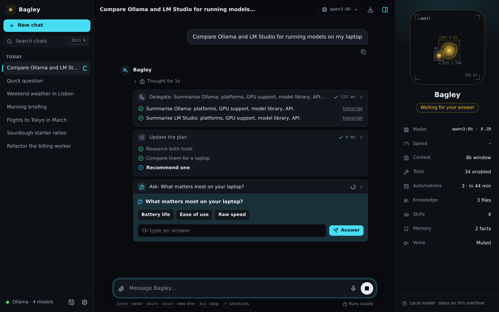
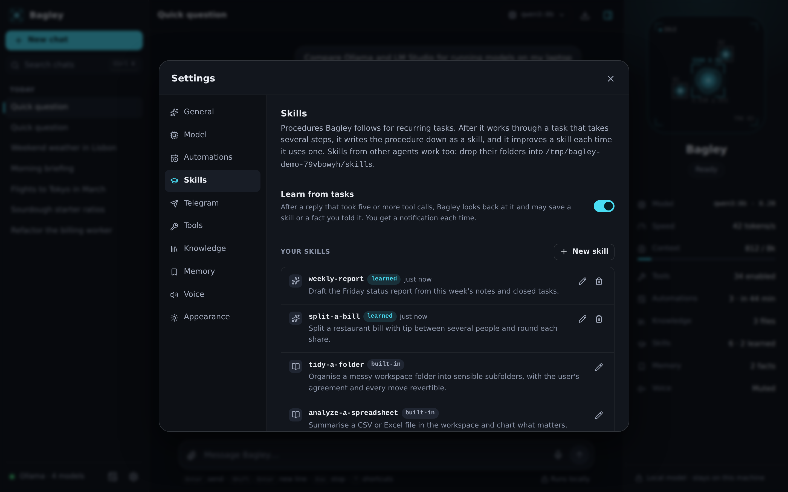
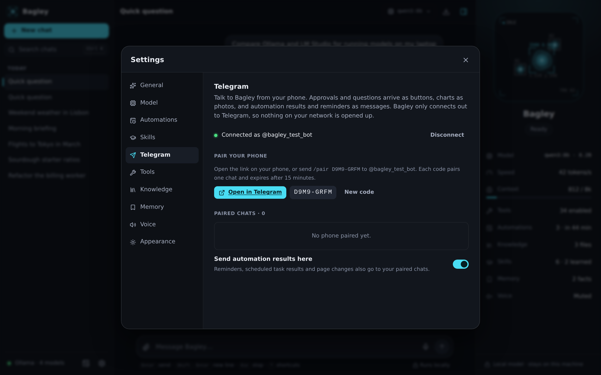
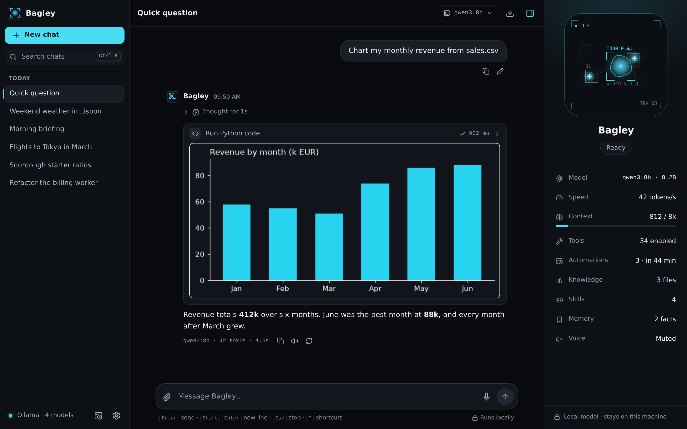
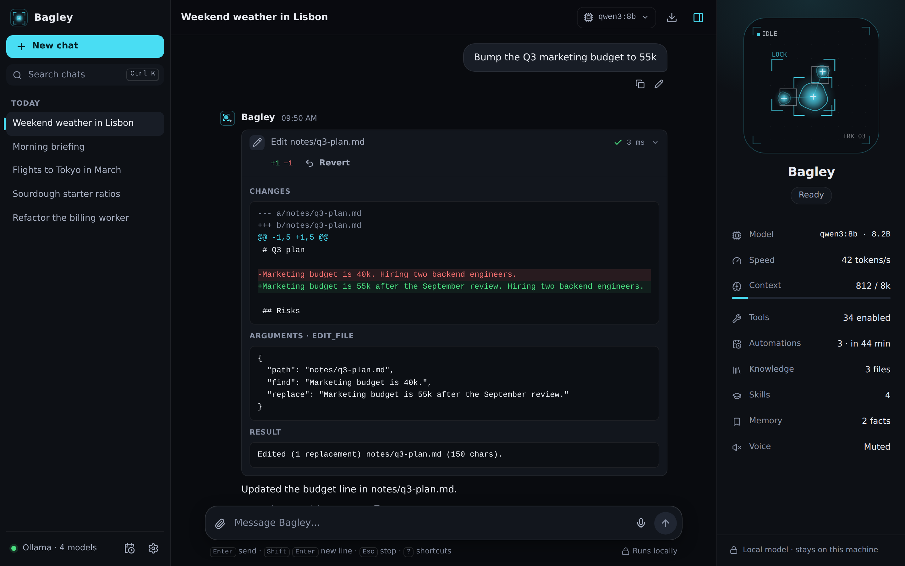
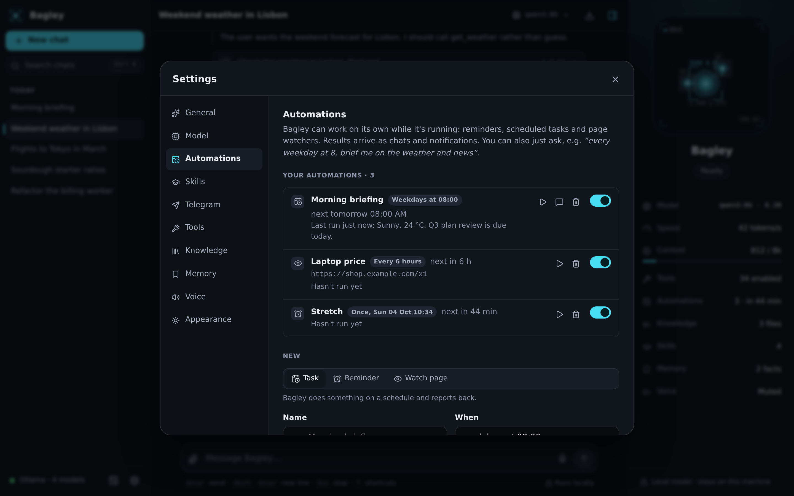
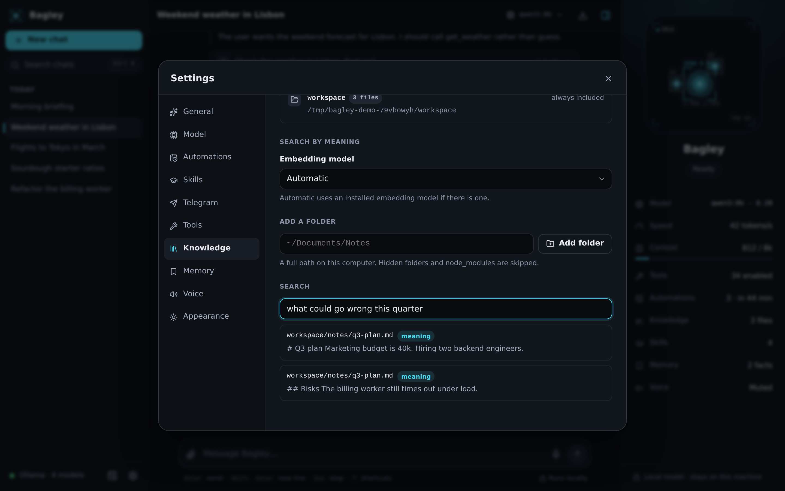
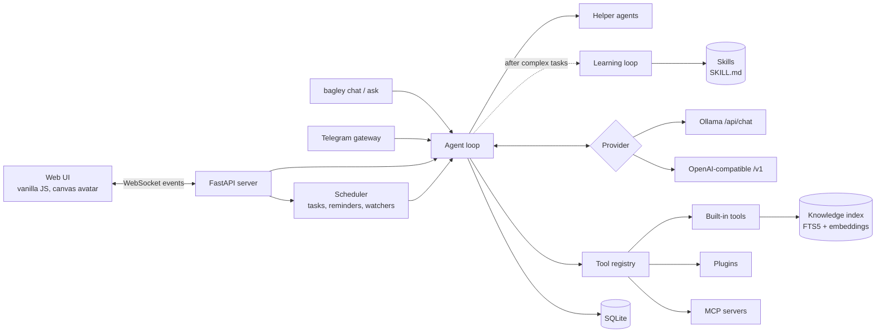

<div align="center">


# Bagley

A local-first AI assistant with an animated avatar, tool use and a web UI.<br>
Runs on Ollama or any OpenAI-compatible model server. Your conversations stay on your machine.

[](https://github.com/H4ch1Net/bagley-assistant/actions/workflows/ci.yml)


[](LICENSE)


</div>

## Overview

Bagley is a personal assistant that runs against a model on your own computer. It is agentic: the model can call tools (search the web, read pages, check the weather, do exact maths, work with files, remember facts about you), look at the results and keep going until it has an answer. Actions that change things ask for your approval first.

Because it runs on your machine, it can do things a hosted chat app cannot. It keeps working when no window is open: reminders, scheduled tasks and page watchers run in the background and notify you. It searches your own documents by meaning, not just keywords. It edits files with a diff and a one-click undo, runs Python and shows the charts inline, and can check what is slowing your computer down.

It also gets better with use, in the spirit of [Hermes Agent](https://github.com/NousResearch/hermes-agent). After a task that takes several steps, it writes the procedure down as a skill and improves that skill the next time it follows it. For bigger jobs it keeps a visible plan, asks you when a choice matters, hands research to helper agents with a fresh context, and looks up earlier conversations. You can talk to it from your phone through your own Telegram bot.

It is a single Python package with no build step. The server is FastAPI, the UI is plain JavaScript, and everything is stored in one SQLite file.

## Features

| | |
|---|---|
| **Animated avatar** | A minimal blob-tracking display: soft blobs drift in a dark viewport under thin tracking boxes, centroids and readouts. Their number, speed, links and colour show what Bagley is doing: a few slow tracks when idle, a dense linked mesh while thinking, a scan line and the tool's name while a tool runs, amber while it waits for approval, a lock-on box when a reply lands, dim dashed tracks when the model server is offline. |
| **Local models** | Native Ollama support (context size, reasoning, one-click model downloads) and any OpenAI-compatible server: LM Studio, llama.cpp, vLLM, LocalAI, Jan, OpenRouter, OpenAI. |
| **Agent loop** | Multi-step tool calling with streaming, cancellation, step limits and approvals. Models without native function calling use a text-based tool protocol automatically. |
| **Built-in tools** | Web search, page reader, weather, calculator, time zones, workspace files, long-term memory, optional shell. |
| **Skills that it learns** | Reusable procedures in the open `SKILL.md` format. After a reply that took five or more tool calls, Bagley reviews what it did in the background and saves a skill, or improves the one it followed, plus any lasting facts you told it. Four skills ship with it; skills written for other agents can be dropped in. |
| **Plans and questions** | For multi-step tasks it shows a live checklist, and when a choice matters it asks with option buttons instead of guessing. |
| **Helper agents** | `delegate_task` hands up to five subtasks to helpers that start with an empty context, so long reading doesn't fill the conversation. Only their answers come back; each helper's transcript is one click away. |
| **Recall** | `search_chats` finds and reads earlier conversations ("what did we decide about the trip?"). |
| **Telegram** | Chat with Bagley from your phone through your own bot: approvals and questions as buttons, charts as photos, reminders and automation results as messages. Outbound only, paired with a one-time code. |
| **Automations** | Reminders, scheduled tasks ("weekdays at 8:00, give me the weather and my calendar notes") and web page watchers ("tell me when this price drops"). They run in the background, post into their own chat and notify you, also as a desktop notification. Create them in chat or under **Settings → Automations**. |
| **Knowledge base** | Indexes your workspace and any folders you add (text, Markdown, code, HTML, PDF) into a local full-text index. With an embedding model installed (`ollama pull nomic-embed-text`) it also searches by meaning. Answers cite the files they came from. |
| **Undoable file changes** | Every write, edit, move and delete is journaled. Tool cards show a diff, and **Revert** restores the previous version. Deleted files are kept in the journal, not destroyed. |
| **Python and charts** | `run_python` runs a script in the workspace (after approval) and shows any chart or image it produces inline in the chat. Use it on your CSV and Excel files. |
| **Your computer** | Live CPU, memory, disk, battery and top processes, opening pages and files on your screen, and notifications. |
| **Small-model friendly** | Tools load on demand: core tools are always sent and the rest join when the conversation needs them, which roughly halves the prompt for small models. |
| **Model manager** | See which models are installed and which are in memory, and unload or delete them from **Settings → Model** (Ollama). |
| **Extensible** | Drop a Python file into the plugins folder, or connect any MCP (Model Context Protocol) server. |
| **Reasoning models** | Thinking from qwen3, deepseek-r1 or gpt-oss streams into a collapsible block, separate from the answer. |
| **Chat history** | Search, rename, delete with undo, Markdown export, edit and resend, regenerate, deep links. |
| **Attachments** | Drop text files on the composer. They are saved to the workspace where the file tools can read them. |
| **Voice** | Read replies aloud with your system voices (the tracked blobs pulse with each word). Optional dictation where the browser supports it. |
| **Interface** | Dark and light themes, accent colours, keyboard shortcuts, responsive down to phone width, reduced-motion support, a tab-title marker when a reply finishes in the background. |
| **Terminal** | `bagley chat` for a terminal session, `bagley ask` for scripts and pipes, `bagley doctor` to check your setup. |

## Quick start

**1. Run a model server.** The easiest is [Ollama](https://ollama.com/download):

```bash
ollama pull qwen3:4b
```

Any model works. Models with tool support give the best results; see [Choosing a model](#choosing-a-model).

**2. Install Bagley** (Python 3.10 or newer):

```bash
pipx install git+https://github.com/H4ch1Net/bagley-assistant
# or: uv tool install git+https://github.com/H4ch1Net/bagley-assistant
# or, from a clone: pip install -e .
```

**3. Start it:**

```bash
bagley
```

This opens <http://127.0.0.1:8765>. If no model server is found, the start screen walks you through connecting one, and with Ollama you can download models from the UI.

## Screenshots

<table>
  <tr>
    <td width="50%"><br><sub>A plan, helper agents doing the reading, and a question when a choice matters.</sub></td>
    <td width="50%"><br><sub>Skills it learned from earlier tasks, next to the built-in ones.</sub></td>
  </tr>
  <tr>
    <td width="50%"><br><sub>Your own Telegram bot, paired with a one-time code.</sub></td>
    <td width="50%"><br><sub>Python runs in the workspace and its charts appear in the chat.</sub></td>
  </tr>
  <tr>
    <td><br><sub>File changes show a diff and can be reverted.</sub></td>
    <td><br><sub>Scheduled tasks, reminders and page watchers.</sub></td>
  </tr>
  <tr>
    <td><br><sub>Knowledge base with keyword and semantic search.</sub></td>
    <td><br><sub>Model settings, installed models and what is loaded in memory.</sub></td>
  </tr>
  <tr>
    <td width="50%"><br><sub>Actions that change things wait for approval.</sub></td>
    <td width="50%"><br><sub>Start screen.</sub></td>
  </tr>
  <tr>
    <td><br><sub>First run without a model server. The tracker reads NO SIGNAL.</sub></td>
    <td><br><sub>Light theme.</sub></td>
  </tr>
  <tr>
    <td align="center" colspan="2"><br><sub>Phone layout.</sub></td>
  </tr>
</table>

## Usage

### Web UI

Type a message and press <kbd>Enter</kbd>. Tool calls appear as cards you can expand to see arguments and results. The panel on the right shows the avatar, the current state, the model, generation speed, context usage, enabled tools and saved memories. Hide it with <kbd>Ctrl</kbd> <kbd>.</kbd> and the avatar moves to the top bar.

| Shortcut | Action |
|---|---|
| <kbd>Ctrl</kbd> <kbd>Shift</kbd> <kbd>O</kbd> | New chat |
| <kbd>Ctrl</kbd> <kbd>K</kbd> | Search chats |
| <kbd>/</kbd> | Focus the message box |
| <kbd>Esc</kbd> | Stop the current reply |
| <kbd>↑</kbd> | Edit your last message (in an empty message box) |
| <kbd>Ctrl</kbd> <kbd>Shift</kbd> <kbd>C</kbd> | Copy the last reply |
| <kbd>Ctrl</kbd> <kbd>.</kbd> | Toggle the Bagley panel |
| <kbd>Ctrl</kbd> <kbd>,</kbd> | Settings |
| <kbd>?</kbd> | Show all shortcuts |

On macOS use <kbd>⌘</kbd> instead of <kbd>Ctrl</kbd>.

### Command line

| Command | Description |
|---|---|
| `bagley` | Start the server and open the browser. Same as `bagley serve`. |
| `bagley serve --port 9000 --no-browser` | Start on another port without opening a tab. `--host` sets the bind address. |
| `bagley chat` | Chat in the terminal. `-c <id>` continues a conversation. Approvals are asked inline. |
| `bagley ask "question"` | Print one answer to stdout. Piped input is attached, so `git diff \| bagley ask "write a commit message"` works. Tools that need approval only run with `--yes`; `-q` hides tool activity. |
| `bagley doctor` | Check the model server, installed models, tool support, workspace, plugins and MCP servers. |
| `python -m bagley` | Same as `bagley`. |

### Tools

| Tool | What it does | Asks first |
|---|---|:---:|
| `web_search` | Search DuckDuckGo, or your SearXNG instance | |
| `fetch_webpage` | Download a page and extract readable text | |
| `get_weather` | Current weather and forecast from Open-Meteo | |
| `calculate` | Exact arithmetic and math functions, evaluated safely | |
| `get_current_time` | Date and time in any time zone | |
| `list_files` `read_file` `search_files` | Browse and read the workspace folder | |
| `write_file` `edit_file` `move_file` `delete_file` | Change files in the workspace. Journaled and revertible | ✓ |
| `make_directory` | Create a folder in the workspace | |
| `search_knowledge` `read_document` | Search and read your indexed documents | |
| `remember` `forget` | Long-term memory, injected into every conversation | |
| `update_plan` | Show a checklist for a multi-step task and keep it current | |
| `ask_user` | Ask you a question, with option buttons, and wait for the answer | |
| `search_chats` | Search and read earlier conversations | |
| `delegate_task` | Hand subtasks to helper agents with a fresh context | |
| `read_skill` | Load a saved procedure before a matching task | |
| `save_skill` `delete_skill` | Write, improve or remove a skill | ✓ |
| `set_reminder` `list_automations` `cancel_automation` | Reminders and managing automations | |
| `schedule_task` `watch_webpage` | Create a recurring task or a page watcher | ✓ |
| `system_status` | CPU, memory, disk, battery, uptime and the busiest processes | |
| `open_on_computer` | Open a web page or a workspace file on your screen | ✓ |
| `notify_user` | Show a notification | |
| `run_command` `run_python` | Run a shell command or a Python script in the workspace. Off unless `BAGLEY_ENABLE_SHELL=true` | ✓ |

Tools can be switched off individually in **Settings → Tools**. File tools cannot leave the workspace folder, and web tools refuse localhost and private network addresses unless you allow them.

### Automations

Ask in plain language ("remind me in 20 minutes to check the oven", "every weekday at 8:00 summarise the news on Rust", "watch this page and tell me when the price changes") or use **Settings → Automations**. Schedules accept forms like `in 45 minutes`, `at 18:30`, `tomorrow at 9am`, `every 2 hours`, `daily at 07:30`, `weekdays at 09:00` and `mondays, thursdays at 18:00`.

Automations run while Bagley is running. A run that was missed while it was off happens once at the next start. Unattended runs are restricted (see [Security](#security)); a refused tool call is recorded in the automation's chat.

### Skills and learning

A skill is a folder with a `SKILL.md` file: front matter with a `name` and a one-line `description`, then Markdown steps. Bagley lists every skill in its instructions and reads the full text with `read_skill` when one matches the request. Four ship with it (`research-a-question`, `morning-briefing`, `analyze-a-spreadsheet`, `tidy-a-folder`). Yours live in `~/.bagley/skills/`, where skills written for other agents in the same format also work.

Learning happens after a reply that took five or more tool calls. Bagley looks back at your request, the tools it called and its answer, then saves a new skill, improves the skill it followed, or remembers a fact you stated about yourself. It never sees tool results while doing this. When the task read web pages, used helpers or past chats, or called plugin tools, the skill is only a draft until you approve it in **Settings → Skills**, and a fact is kept only when most of its words are your own. Each time it learns something you get a notification, and everything it saved is listed in **Settings → Skills** and **Settings → Memory**, where you can edit or delete it, or switch learning off.

### Telegram

1. In Telegram, message **@BotFather**, send `/newbot` and copy the token.
2. Paste it in **Settings → Telegram** (or set `BAGLEY_TELEGRAM_TOKEN`).
3. Open the pairing link on your phone, or send the bot `/pair` and the code shown in Settings. Each code pairs one chat and expires after 15 minutes. Messages from chats that aren't paired get no further than a pairing hint.

Then talk to it as in the app. `/new` starts a new chat and `/stop` cancels a reply. Approvals and `ask_user` questions arrive as buttons, charts from `run_python` as photos, and reminders and automation results as messages. Bagley polls Telegram over HTTPS, so nothing has to be reachable from the internet, but it only answers while it is running.

### Knowledge base

The workspace is always indexed. Add more folders in **Settings → Knowledge**; the index refreshes every 15 minutes and on demand. Keyword search works out of the box. For search by meaning, install an embedding model (`ollama pull nomic-embed-text`); Bagley picks it up automatically. PDF support needs `pypdf` (`pipx inject bagley-assistant pypdf`, or `pip install -e ".[pdf]"` in a clone).

## Choosing a model

Bagley picks the first installed model that supports tools unless you choose one. Good starting points with Ollama:

| Model | Size | Notes |
|---|---|---|
| `qwen3:4b` | 2.5 GB | Fast, reliable tool use. Recommended default. |
| `llama3.2:3b` | 2.0 GB | Small and quick. |
| `qwen3:8b` | 5.2 GB | Better reasoning. |
| `gpt-oss:20b` | 14 GB | Best quality of these. Needs about 16 GB of memory. |

Models without native function calling (for example `gemma2`) still get tools through the text-based protocol. You can force a mode under **Settings → Model → Tool calling**.

The agentic features (plans, helpers, learning) work with small models but are noticeably more reliable from about 8B parameters up, with a context window of 16k tokens or more.

### Which computer runs the model

Run the model on the machine with the most GPU memory (VRAM), or on a Mac with the most unified memory. Speed comes from fitting the whole model in that memory: a desktop with an 8 to 12 GB graphics card runs `qwen3:8b` comfortably and `qwen3:14b` with 12 GB or more. A laptop with integrated graphics runs `qwen3:4b` on the CPU, slowly. Automations and Telegram need Bagley to be running, so the machine that stays on is the better home for both.

Bagley and the model can also be on different machines. Run Ollama on the desktop with `OLLAMA_HOST=0.0.0.0`, then point Bagley at it from the laptop with `BAGLEY_BASE_URL=http://<desktop-ip>:11434`.

### Other servers

Point Bagley at any OpenAI-compatible endpoint in **Settings → Model**, or with environment variables:

| Server | `BAGLEY_BASE_URL` |
|---|---|
| Ollama | `http://localhost:11434` |
| LM Studio | `http://localhost:1234/v1` |
| llama.cpp (`llama-server --jinja`) | `http://localhost:8080/v1` |
| vLLM | `http://localhost:8000/v1` |
| OpenRouter, OpenAI and other hosted APIs | the provider's base URL, plus `BAGLEY_API_KEY` |

With `BAGLEY_PROVIDER=auto` (the default) Bagley detects Ollama by its API and treats anything else as OpenAI-compatible.

## Configuration

Settings changed in the UI are stored in the database. Environment variables (or a `.env` file in the directory you start Bagley from) take precedence, and fields set that way are shown as locked in the UI. See [`.env.example`](.env.example) for every option.

<details>
<summary><b>Environment variables</b></summary>

| Variable | Default | Description |
|---|---|---|
| `BAGLEY_PROVIDER` | `auto` | `auto`, `ollama` or `openai` |
| `BAGLEY_BASE_URL` | `http://localhost:11434` | Model server URL. `OLLAMA_HOST` is used if this is unset. |
| `BAGLEY_API_KEY` | | For hosted APIs |
| `BAGLEY_MODEL` | first tool-capable model | Model name |
| `BAGLEY_TEMPERATURE` | `0.6` | 0 to 2 |
| `BAGLEY_CONTEXT_TOKENS` | `8192` | Context window. Sent to Ollama as `num_ctx`; history is trimmed to fit. |
| `BAGLEY_MAX_STEPS` | `8` | Tool rounds per reply |
| `BAGLEY_TOOL_MODE` | `auto` | `auto`, `native`, `prompt` (text-based) or `off` |
| `BAGLEY_THINK` | `false` | Let reasoning models think before answering |
| `BAGLEY_PERSONA` | `bagley` | `bagley`, `professional` or `concise` |
| `BAGLEY_HOST` | `127.0.0.1` | Bind address |
| `BAGLEY_PORT` | `8765` | Port |
| `BAGLEY_TOKEN` | | Access token. Generated automatically when listening beyond localhost. |
| `BAGLEY_ALLOWED_HOSTS` | | Extra Host header names, comma separated |
| `BAGLEY_DATA_DIR` | `~/.bagley` | Database, workspace, plugins |
| `BAGLEY_WORKSPACE` | `<data dir>/workspace` | Folder the file tools can use |
| `BAGLEY_PLUGINS_DIR` | `<data dir>/plugins` | Python files with extra tools |
| `BAGLEY_MCP_CONFIG` | `<data dir>/mcp.json` | MCP server list |
| `BAGLEY_ENABLE_SHELL` | `false` | Register the `run_command` and `run_python` tools |
| `BAGLEY_PYTHON` | Bagley's own | Python interpreter for `run_python`, e.g. a venv with pandas and matplotlib |
| `BAGLEY_ALLOW_PRIVATE_URLS` | `false` | Let web tools reach private addresses |
| `BAGLEY_SEARXNG_URL` | | Use SearXNG for web search |
| `BAGLEY_TELEGRAM_TOKEN` | | Telegram bot token from @BotFather |

</details>

Data lives in `~/.bagley`: `bagley.db` (chats, memories, settings, automations, file change journal), `knowledge.db` (search index), `journal/` (previous versions of changed files), `skills/` (your and learned skills), `workspace/`, `plugins/` and `mcp.json`. Deleted chats can be restored with Undo; they are purged on the first start more than 24 hours after deletion.

## Extending

### Plugins

Any Python file in `~/.bagley/plugins/` is loaded at startup. Decorate functions with `@tool`; type hints become the parameter schema and the docstring becomes the description the model sees.

```python
from typing import Annotated
from bagley.tools import ToolContext, tool


@tool(summary="Roll {count}d{sides}")
def roll_dice(sides: Annotated[int, "Faces per die"] = 6, count: int = 1) -> dict:
    """Roll dice and return each result and the total."""
    ...


@tool(risk="confirm")  # Ask the user before every call.
def send_report(ctx: ToolContext, text: str) -> str:
    """Write a report into the workspace."""
    (ctx.config.workspace / "report.md").write_text(text)
    return "Saved."
```

A complete example is in [`examples/plugins/example_tools.py`](examples/plugins/example_tools.py). Load errors are listed in **Settings → Tools** and in `bagley doctor`.

### MCP servers

Bagley is an MCP client for stdio servers. Create `~/.bagley/mcp.json` in the same format other MCP clients use (see [`examples/mcp.json`](examples/mcp.json)) and restart:

```json
{
  "mcpServers": {
    "filesystem": {
      "command": "npx",
      "args": ["-y", "@modelcontextprotocol/server-filesystem", "/home/me/notes"]
    }
  }
}
```

Their tools appear as `<server>__<tool>`. Each call asks for approval unless the server has `"trust": true`.

## Security

Bagley can act on your behalf, so it is locked down by default:

- It listens on `127.0.0.1` only. When bound to another address it requires a token, which `bagley` prints in the URL.
- The server rejects foreign `Host` headers (DNS rebinding) and cross-origin requests and WebSocket connections, so other websites cannot drive it.
- File tools are confined to the workspace folder, symlinks included.
- Web tools refuse loopback and private network addresses, re-check every redirect, and connect to the exact address they checked, so DNS rebinding can't point them at your network. Downloads are capped in size.
- File changes, `run_command`, `run_python`, new scheduled tasks and watchers, and untrusted MCP tools wait for your approval. Shell and Python access are off unless you enable them, and stopping a command ends everything it started.
- Automations run without you watching. During those runs, tools that need approval are denied, and memories, automations and folders can't be changed. Once a run has read web content it can't read your files or notes, and it can only open pages from its search results. Watcher instructions run with no tools at all. Text on a web page therefore can't send your data anywhere.
- Every file change is journaled with the previous version, so a bad edit can be reverted.
- Helper agents run under the same rules as automations, can't ask you anything, and can't start helpers of their own. A helper started by an automation that has already read web content inherits those limits.
- The learning loop only sees your words, the names and arguments of the tools it called, and its own answer, never tool results. Skills learned from tasks that touched web content wait for your approval, and saving a skill from a chat asks first.
- Telegram serves only chats paired with a one-time code, and a chat that sends five wrong codes is ignored for an hour. Approvals show the full arguments of the action. Taps from any other chat are ignored, and the bot token is stored like the API key, never sent to the browser and kept out of the logs.
- A saved API key is cleared when the server URL changes, and a key set through `BAGLEY_API_KEY` locks the server URL, so the key only goes where you configured it.
- The UI loads nothing from the internet and sends a strict Content-Security-Policy. Model output is sanitized: no images, frames or forms, so a prompt-injected page can't make the browser leak data.

## Architecture



Each user message starts an agent run. The agent builds the context (persona, date, memories, tool list, trimmed history), streams the model's reply, executes any tool calls (pausing for approval where needed) and loops until the model answers without tools or the step limit is reached. Every step is persisted, and events stream to the UI as they happen.

<details>
<summary><b>Project structure</b></summary>

```
bagley/
├── agent.py          Agent loop, context fitting, approvals, cancellation
├── automations.py    Schedule parser and background scheduler
├── cli.py            bagley serve | chat | ask | doctor
├── config.py         Server config and user preferences (env + database)
├── delegation.py     Helper agents with a fresh context
├── journal.py        File change journal, diffs and revert
├── knowledge.py      Document index: FTS5, embeddings, rank fusion
├── learning.py       Reflection after complex tasks: skills and facts
├── mcp.py            MCP stdio client
├── policy.py         Limits for runs nobody is watching
├── prompts.py        Personas, system prompt, text-based tool protocol
├── runtime.py        Shared state: store, tools, provider, scheduler, notifications
├── server.py         HTTP API, WebSocket sessions, security middleware
├── skills.py         SKILL.md store (built-in, yours, learned)
├── store.py          SQLite persistence
├── telegram.py       Telegram gateway
├── toolroute.py      On-demand tool loading
├── builtin_skills/   Skills that ship with Bagley
├── llm/              Ollama and OpenAI-compatible providers, stream parser
├── tools/            Registry, @tool decorator and built-in tools
└── static/           Web UI (HTML, CSS, JS modules, vendored marked and DOMPurify)
examples/             Plugin and MCP config examples
scripts/screenshots.py  Regenerates docs/screenshots against a mock model server
tests/                Unit, API, WebSocket and browser tests, mock model server
```

</details>

## Development

```bash
git clone https://github.com/H4ch1Net/bagley-assistant
cd bagley-assistant
python -m venv .venv && source .venv/bin/activate   # Windows: .venv\Scripts\activate
pip install -e ".[dev]"

pytest                 # unit, API and WebSocket tests
ruff check . && ruff format --check .
```

The tests run against `tests/mock_llm.py`, a scripted server that speaks both the Ollama and OpenAI wire formats, so no model or network access is needed.

Browser tests and screenshots use Playwright:

```bash
pip install -e ".[dev,screenshots]"
python -m playwright install chromium
pytest -m ui                          # drive the real UI in Chromium
python scripts/screenshots.py         # regenerate docs/screenshots
python scripts/screenshots.py --serve # demo at http://127.0.0.1:8790 with the mock model
```

The frontend has no build step. Edit the files in `bagley/static/` and reload the page.

Pull requests are welcome. Please run the tests and the linter, and keep new features covered by tests.

## Troubleshooting

<details>
<summary><b>"Can't reach the model server"</b></summary>

Start Ollama with `ollama serve` (the desktop app starts it automatically) and check the URL in **Settings → Model**. If Ollama runs on another machine or in Docker, set `BAGLEY_BASE_URL` to its address, and make sure Ollama listens beyond localhost (`OLLAMA_HOST=0.0.0.0`). `bagley doctor` shows exactly what fails.
</details>

<details>
<summary><b>The model never uses tools, or prints raw JSON</b></summary>

Use a model with tool support (see the table above). For other models set **Tool calling** to *Text-based*. Very small models (under 3B parameters) are often unreliable with tools.
</details>

<details>
<summary><b>Replies are slow, or the model forgets earlier messages</b></summary>

Lower the context window for speed or raise it for memory (both in **Settings → Model**). Turn off *Reasoning* for faster answers from thinking models. The Context row in the side panel shows how full the window was on the last reply.
</details>

<details>
<summary><b>Knowledge search only matches exact words</b></summary>

Semantic search needs an embedding model. Run `ollama pull nomic-embed-text` (or choose one under **Settings → Knowledge**) and press **Reindex**. With an OpenAI-compatible server, pick an embedding model your server provides.
</details>

<details>
<summary><b>run_python can't import pandas or matplotlib</b></summary>

It uses Bagley's own Python by default. Point `BAGLEY_PYTHON` at an interpreter that has your data libraries, for example a virtual environment's `bin/python`.
</details>

<details>
<summary><b>Web search returns nothing</b></summary>

DuckDuckGo occasionally rate limits automated searches. Run your own [SearXNG](https://docs.searxng.org/) with the JSON format enabled and set `BAGLEY_SEARXNG_URL`.
</details>

<details>
<summary><b>Using Bagley from a phone or another computer</b></summary>

Start it with `bagley --host 0.0.0.0` and open the printed URL, which includes an access token, from the other device. Set `BAGLEY_TOKEN` to keep the same token across restarts.
</details>

<details>
<summary><b>Port 8765 is already in use</b></summary>

Bagley is probably already running. Otherwise start it on another port with `bagley --port 8766`.
</details>

## License

[MIT](LICENSE). Bundles [marked](https://github.com/markedjs/marked) (MIT), [DOMPurify](https://github.com/cure53/DOMPurify) (Apache-2.0 or MPL-2.0) and icons from [Lucide](https://lucide.dev) (ISC).
